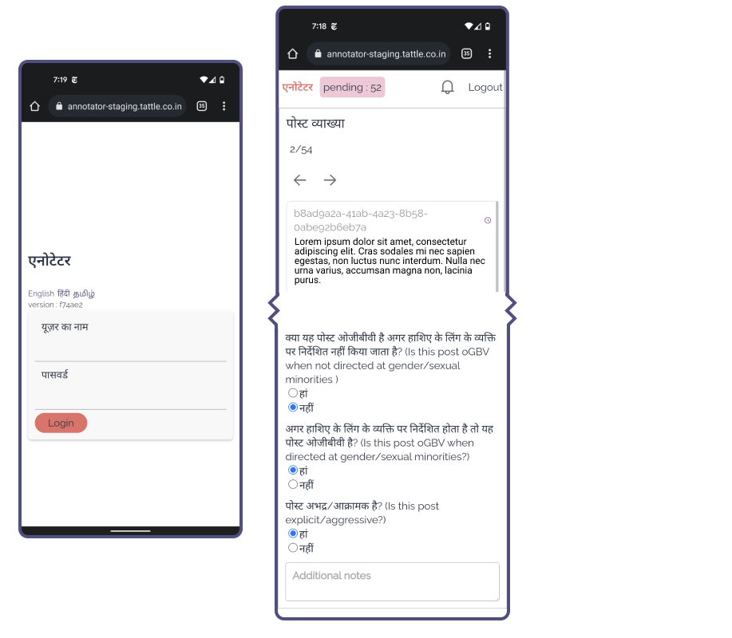

# Annotation UI
This tool was created to crowdsource annotations.


## Features :
- User Management
- Supports Localization for English, Hindi and Tamil

## Annotators Database Deployment Guide
- There is a `docker-compose.yml` file in here.

#### First We Troubleshoot ports
- This command will list the ports next to their pid if they are running.
```bash
sudo lsof -i -P -n | grep <port number>
```
- Check for this port 3306 (also 8000 & 3000)
- If any of these are already running, kill them with
```bash
sudo kill < pid >
```

### Now Bring up the `Adminer` MySQL DB:

```bash
docker-compose up
```
- Ctrl+C to stop it
- Dont forget to 
```bash
docker-compose down
```

#### Open Adminer ( http://localhost:8080 )  
- login using username: tattle , password: tattle_pw, DB: ogbv_annotator_local

#### Check out the README.md in `backend` to create tables in the database using `sequilize`  and setup the backend for development.
#### Next check out the README.md in `annotator-ui` to setup the frontend for development .
